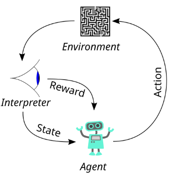

# RL-Lite3

[简体中文](./README_ZH.md)

## 📚 Table of Contents


- [RL-Lite3](#rl-lite3)
  - [📚 Table of Contents](#-table-of-contents)
- [Introduction](#introduction)
  - [System Architecture](#system-architecture)
    - [Actor Network](#actor-network)
      - [Network Structure](#network-structure)
      - [Observations Input (`obs_buf = 117`)](#observations-input-obs_buf--117)
      - [Action Output](#action-output)
  - [Critic Network](#critic-network)
      - [Network Structure](#network-structure-1)
      - [Privileged Observations Input (`privileged_obs_buf = 54`)](#privileged-observations-input-privileged_obs_buf--54)
      - [Advantage Output](#advantage-output)
  - [Proximal Policy Optimization](#proximal-policy-optimization)
      - [Policy Gradient](#policy-gradient)
      - [PPO —— Clip the Gradient](#ppo--clip-the-gradient)
      - [On Policy Runner](#on-policy-runner)
- [Software architecture](#software-architecture)
- [Installation](#installation)
- [Usage](#usage)
  - [Train policy in the simulation](#train-policy-in-the-simulation)
  - [Run controller in the simulation](#run-controller-in-the-simulation)
  - [Run controller in the real-world](#run-controller-in-the-real-world)
  - [Reference](#reference)


# Introduction
A Learning-based locomotion controller for quadruped robots. It includes all components needed for training and hardware deployment on DeepRobotics Lite3.

## System Architecture


This project is based on the **Actor-Critic framework**:

- The **actor network** serves as the core **policy network**, taking the system's observation as input and outputting the **mean of desired joint positions**. These outputs are used as feedforward commands for the **low-level controller**, which executes the actual motor control.

- The **critic network** takes in **privileged observations** of the system and outputs the **advantage estimate**, which is then used by the **PPO algorithm module** to compute the policy gradient and assist in training the actor network.

The project uses the **Isaac Gym** simulator to provide a high-performance environment for interaction, and utilizes a `RolloutStorage` object to buffer and organize trajectory data collected during rollouts.

### Actor Network

#### Network Structure


#### Observations Input (`obs_buf = 117`)


| Feature                         | Description                                  | Dim |
|----------------------------------|----------------------------------------------|-----|
| `commands[:, :3]`               | Desired `[x_vel, y_vel, yaw_vel]` commands   | 3   |
| `rpy`                           | Base orientation (roll, pitch, yaw)          | 3   |
| `base_ang_vel`                  | Base angular velocity                         | 3   |
| `dof_pos`                       | Current joint positions (12 DOFs)            | 12  |
| `dof_vel`                       | Current joint velocities                      | 12  |
| `dof_pos_history`              | Joint positions from last 3 timesteps         | 36  |
| `dof_vel_history`              | Joint velocities from last 2 timesteps        | 24  |
| `action_history` (dof targets) | Past 2 action outputs                         | 24  |
| **Total**                       |                                              | **117** |


#### Action Output

The output `action` of the actor network represents the **mean of desired joint positions**, denoted as `self.transition.action_mean`. Together with `self.transition.action_sigma`, it defines a **Gaussian distribution** over the desired joint angles.

An actual action is sampled from this distribution and then used to compute joint torques according to the type of low-level controller (e.g., PD control or P control).

This structure follows the standard **stochastic policy** design. By introducing sampling-based randomness into the policy, the agent is encouraged to explore a wider range of state-action pairs, helping to avoid getting stuck in local optima.


## Critic Network

#### Network Structure

#### Privileged Observations Input (`privileged_obs_buf = 54`)

These observations are available **only to the critic** during training, which means that the input of critic network is not only those normal observation `obs_buf = 117`, but also `privileged_obs_buf = 54`, for total `117 + 54 = 171` dimensions.


| Feature                      | Description                                                   | Dim |
|------------------------------|---------------------------------------------------------------|-----|
| `contact_states`            | Binary flags for foot contacts (thresholded sensor_force)     | 4   |
| `friction_coefficients`     | Ground friction under each foot                               | 4   |
| `push_forces` / `push_torques` | External disturbances applied to base (force + torque)     | 6   |
| `mass_payloads - 6`         | Payload perturbation from nominal value                       | 1   |
| `com_displacements`         | Displacement of center of mass from nominal                   | 3   |
| `motor_strengths - 1`       | Multipliers for actuator strength (per joint)                 | 12  |
| `Kp_factors - 1`            | Proportional gain multipliers                                 | 12  |
| `Kd_factors - 1`            | Derivative gain multipliers                                   | 12  |
| **Total**                   |                                                               | **54** |


#### Advantage Output

The output of the critic network is `self.transition.values`.These values are later used during the PPO update process to compute the policy gradient. This process will be elaborated in the upcoming section on PPO and Generalized Advantage Estimation (GAE).


## Proximal Policy Optimization

#### Policy Gradient

In this project, the policy is essentially a neural network, the training process is about optimizing the network parameters to maximize the total reward:

$$
\theta^* = \arg\max_\theta\ \mathbb{E}_{\tau \sim p_\theta(\tau)} 
\left[ \sum_t r(s_t, a_t) \right]
$$

$$
\nabla_\theta J(\theta) = \mathbb{E}_{\pi_\theta} \left[ 
\nabla_\theta \log \pi_\theta(a_t \mid s_t) \cdot \hat{A}_t 
\right]
$$

Where $\hat{A}_t$ is the Advantage function, measuring how much an action is better than the average action.

In supervised learning, we typically need a loss function to compute the error gradient for each
parameter, and the parameters are updated in the direction that minimizes the loss. In this project, we construct a **surrogate loss function** by taking the negative of the **total reward**.

This surrogate loss is then used as the loss function during training, and gradients are propagated backward to update the network parameters.

In essence, **minimizing the surrogate loss is equivalent to maximizing the total reward**, thereby guiding the agent to learn a more optimal policy.


#### PPO —— Clip the Gradient
The core idea of **Proximal Policy Optimization (PPO)** is to address the issue of **catastrophic update** that arises in vanilla policy gradient methods. 

In standard policy gradient algorithms, large policy updates can cause the new policy to deviate significantly from the old one, often leading to performance degradation.

To address this, the **Natural Policy Gradient** method treats the policy as a probability distribution and updates it in the “most natural” direction — one that considers the **Kullback-Leibler (KL) divergence** between the new and old policies:
$$
\max_\theta \nabla_\theta J(\theta) \quad \text{s.t.} \quad D_{\mathrm{KL}}(\pi_{\theta_{\text{old}}} \,\|\, \pi_\theta) \leq \delta
$$
$$
\theta_{\text{new}} = \theta_{\text{old}} + \alpha F^{-1} \nabla_\theta J(\theta)
$$


However, this requires estimating or inverting the **Fisher Information Matrix**, which is computationally expensive.

Later, **Trust Region Policy Optimization (TRPO)** simplified the natural gradient approach by formulating the update as a constrained optimization problem with a KL divergence constraint:
$$
\max_\theta\ \hat{\mathbb{E}} \left[ 
\frac{\pi_\theta(a \mid s)}{\pi_{\theta_{\text{old}}}(a \mid s)} \cdot \hat{A}_t 
\right]
\quad \text{s.t.} \quad 
\hat{\mathbb{E}} \left[ D_{\mathrm{KL}}(\pi_{\theta_{\text{old}}} \,\|\, \pi_\theta) \right] \leq \delta
$$


While more stable, TRPO still involves complex implementation and high computational cost.

**PPO** is a further simplification of TRPO. It achieves the same goal — **restricting the policy update step size** — using a much simpler mechanism known as the **Clipped Surrogate Objective**, which is what we adopt in this project.
$$
L^{\text{CLIP}}(\theta) = 
\hat{\mathbb{E}} \left[ 
\min \left( 
\frac{\pi_\theta(a_t \mid s_t)}{\pi_{\theta_{\text{old}}}(a_t \mid s_t)} \cdot \hat{A}_t,\ 
\text{clip} \left( 
\frac{\pi_\theta(a_t \mid s_t)}{\pi_{\theta_{\text{old}}}(a_t \mid s_t)},\ 
1 - \epsilon,\ 1 + \epsilon 
\right) \cdot \hat{A}_t 
\right) 
\right]
$$

For a more in-depth theoretical introduction to PPO, we recommend reading the following article:  
[https://jonathan-hui.medium.com/rl-proximal-policy-optimization-ppo-explained-77f014ec3f12](https://jonathan-hui.medium.com/rl-proximal-policy-optimization-ppo-explained-77f014ec3f12)


#### On Policy Runner


<!-- 
$$
\mathcal{L}_{\text{surrogate}}(\theta) = - \sum_t \min \left( 
\frac{\pi_\theta(a_t | s_t)}{\pi_{\theta_{\text{old}}}(a_t | s_t)} \hat{A}_t,\ 
\text{clip}\left( 
\frac{\pi_\theta(a_t | s_t)}{\pi_{\theta_{\text{old}}}(a_t | s_t)},\ 
1 - \epsilon,\ 1 + \epsilon 
\right) \hat{A}_t 
\right)
$$ -->


# Software architecture
This repository consists of below directories:
- rsl_rl: a package wrapping RL methods.
- legged_gym: gym-style environments of quadruped robots.


# Installation
1.  Create a python (3.6/3.7/3.8, 3.8 recommended) environment on Ubuntu OS.

2.  Install pytorch with cuda.
```
# pytorch
pip3 install torch==1.10.0+cu113 torchvision==0.11.1+cu113 torchaudio==0.10.0+cu113 -f https://download.pytorch.org/whl/cu113/torch_stable.html
```

3.  Download Isaac Gym (version >=preview 3) from the official website and put it into the root directory of the project.

4. Install python dependencies with pip.
```
pip3 install transformations matplotlib gym tensorboard numpy=1.23.5
```

5. Install legged_gym and rsl_rl by pip
```
cd legged_gym
pip install -e .

cd rsl_rl
pip install -e .
```

6. Install pandas for visualization
```
pip install pandas

```

# Usage

## Train policy in the simulation
```
cd ${PROJECT_DIR}
python3 legged_gym/legged_gym/scripts/train.py --rl_device cuda:0 --sim_device cuda:0 --headless
```

## Run controller in the simulation
```
cd ${PROJECT_DIR}
python3 legged_gym/legged_gym/scripts/play.py --rl_device cuda:0 --sim_device cuda:0 --load_run ${model_dir} --checkpoint ${model_name}
```
Check that your computer has a GPU, otherwise, replace the word `cuda:0` with `cpu`.
You should assign the path of the network model via `--load_run` and `--checkpoint`. 

## Run controller in the real-world

Copy your policy file to the project [rl_deploy](https://github.com/DeepRoboticsLab/Lite3_rl_deploy.git),then you can run your reinforcement learning controller in the real world


<!-- # Project Algorithm Tutorial


Since the release of Isaac Gym in 2021 <sup>[1](#ref1)</sup> , reinforcement learning-based approaches for legged robot locomotion have gained increasing attention. Locomotion controllers trained through reinforcement learning have demonstrated impressive locomotion capabilities and often exhibit better generalization than traditional model-based control methods that rely on analytical dynamics.

How is it achieved? What exactly is reinforcement learning? How does it control a legged robot? What are the algorithmic principles and architectural structures behind it? In the following part of this section, we will introduce the fundamentals of reinforcement learning (RL) and the specific RL algorithm used in this project.

## Foundation of Reinforcement Learning
Richard S. Sutton, known as the father of reinforcement learning, once wrote in his foundational book *Reinforcement Learning: An Introduction*:

> *“Reinforcement learning is learning what to do — how to map situations to actions — so as to maximize a numerical reward signal.”*

However, if I had to describe reinforcement learning in just one sentence, I would prefer:

> *“Reinforcement Learning is learning from experience.”*

The learning process of RL is much like how a human infant learns to walk: guided by the call of a parent or the temptation of a distant toy, we fall repeatedly and slowly learn to stand, walk, and eventually run.

A reinforcement learning process can be viewed as a mathematical abstraction of real-world decision making. More specifically, we typically model reinforcement learning as a **Markov Decision Process (MDP)**, which consists of the following four core components:

- **State $S$ (observation)**: Represents the current situation of the environment.
- **Action $A$ (control output)**: The set of operations the agent can take.
- **Reward $R$**: Feedback signal received after the agent takes an action.
- **Transition function $T$**: Describes how the state evolves based on the action taken.

A **policy $π$** is a mapping from states to actions — given the current state (or observation), it outputs the action that the agent will take.

The objective of reinforcement learning is to train an optimal policy that chooses the best action in every state in order to **maximize the cumulative long-term reward $R$**.

<p align="center">
  
  <br>
  <em>Figure 1: RL Process Diagram.</em>
</p>

This may still sound a bit abstract, so let’s go back to the example of a child learning to walk.

In this reinforcement learning (RL) scenario, the child is the **agent**. The goal is to train a strong “brain” (i.e., the **policy**) that can take in observations of the **environment** — whether visual, auditory, or tactile — and decide on the appropriate **actions**, such as walking, stepping, or turning.

The aim of this process is to achieve a goal and receive a **reward**, which is provided by the environment. For instance, when a child stands up, parents often clap, cheer, give a kiss, or offer a piece of candy — this is the environment giving a positive reward to the agent.

Sometimes, the child may fall and hurt their bottom — this too is a form of environmental feedback, but it's a **negative reward**.

Through this trial-and-error process, the agent learns: “If I do this, I get a reward; if I do that, I don’t.” The policy is dynamically adjusted so that it increasingly favors actions that lead to positive rewards.

Eventually, under the guidance of well-shaped rewards, we learn how to walk.

## From Policy Gradient to Proximal Policy Optimization -->


## Reference
- [legged_gym](https://github.com/leggedrobotics/legged_gym.git)
- [rsl_rl](https://github.com/leggedrobotics/rsl_rl)
- [quadruped-robot](https://gitee.com/HUAWEI-ASCEND/quadruped-robot.git)
  
<a name="ref1">[1]</a> Viktor Makoviychuk, Lukasz Wawrzyniak, Yunrong Guo, Michelle Lu, Kier Storey, Miles Macklin, David Hoeller, Nikita Rudin, Arthur Allshire, Ankur Handa, and Gavriel State. *"Isaac Gym: High Performance GPU-Based Physics Simulation For Robot Learning."* arXiv preprint [arXiv:2108.10470](https://arxiv.org/abs/2108.10470), 2021.
  
[Communication](https://www.deeprobotics.cn/en/index/company.html#maps)
