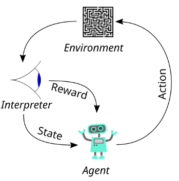

# RL-Lite3

[English](./README.md)


- [RL-Lite3](#rl-lite3)
  - [简介](#简介)
  - [系统架构](#系统架构)
    - [Actor 网络](#actor-网络)
      - [网络结构](#网络结构)
      - [观测输入（`obs_buf = 117`）](#观测输入obs_buf--117)
      - [动作输出](#动作输出)
  - [Critic 网络](#critic-网络)
      - [网络结构](#网络结构-1)
      - [特权观测输入（`privileged_obs_buf = 54`）](#特权观测输入privileged_obs_buf--54)
      - [优势输出](#优势输出)
  - [PPO（Proximal Policy Optimization）](#ppoproximal-policy-optimization)
      - [策略梯度](#策略梯度)
      - [PPO —— Clip 策略更新幅度](#ppo--clip-策略更新幅度)
      - [On Policy 运行器](#on-policy-运行器)
  - [软件架构](#软件架构)
  - [准备环境](#准备环境)
- [使用方法](#使用方法)
    - [在仿真环境中训练策略](#在仿真环境中训练策略)
    - [在仿真环境中运行控制器](#在仿真环境中运行控制器)
    - [在现实环境中运行控制器](#在现实环境中运行控制器)
  - [参考资料](#参考资料)
## 简介

一个基于学习的四足机器人运动控制器，包含训练和在 DeepRobotics Lite3 上硬件部署所需的所有组件。

## 系统架构


本项目整体基于 **Actor-Critic 架构**：

- **Actor 网络** 是核心的策略网络，输入为系统观测，输出为期望关节位置的均值，作为前馈项传入 **低级控制器**（low-level controller）执行实际控制。

- **Critic 网络** 输入系统的 **特权观测**，输出优势估计（Advantage），传入 **PPO 算法模块** 用于计算 policy gradient，辅助训练 actor 网络。

项目使用 **Isaac Gym** 仿真器提供高性能交互环境，并通过 `RolloutStorage` 对象缓存和组织交互过程中采集的数据。

### Actor 网络

#### 网络结构

#### 观测输入（`obs_buf = 117`）

| 特征                             | 描述                                         | 维度 |
|----------------------------------|----------------------------------------------|------|
| `commands[:, :3]`               | 期望的 `[x_vel, y_vel, yaw_vel]` 指令        | 3    |
| `rpy`                           | 基座欧拉角（roll, pitch, yaw）               | 3    |
| `base_ang_vel`                  | 基座角速度                                   | 3    |
| `dof_pos`                       | 当前关节位置（12 个自由度）                 | 12   |
| `dof_vel`                       | 当前关节速度                                 | 12   |
| `dof_pos_history`              | 过去 3 帧的关节位置                          | 36   |
| `dof_vel_history`              | 过去 2 帧的关节速度                          | 24   |
| `action_history`               | 过去 2 帧的动作输出（目标关节位置）         | 24   |
| **总计**                       |                                              | **117** |

#### 动作输出

Actor 网络的输出 `action` 表示期望关节位置的均值 `self.transition.action_mean`，结合 `self.transition.action_sigma`，构成一个期望关节角度的高斯分布。

从该分布中采样得到实际的期望关节角度，然后依据低级控制器的类型（如 PD 控制或力控制）生成关节力矩。

这是一种标准的 **随机策略（Stochastic Policy）** 结构，引入策略采样的随机性以鼓励探索，避免陷入局部最优。

## Critic 网络

#### 网络结构

#### 特权观测输入（`privileged_obs_buf = 54`）

这些观测 **只提供给 critic 网络训练用**，即其输入包含标准观测 `obs_buf = 117` 以及特权观测 `privileged_obs_buf = 54`，共计 `117 + 54 = 171` 个维度。

| 特征                    | 描述                                                   | 维度 |
|-------------------------|----------------------------------------------------------|------|
| `contact_states`       | 足端接触标志（二值）                                   | 4    |
| `friction_coefficients`| 每个足底的地面摩擦系数                                 | 4    |
| `push_forces/torques`  | 作用在 base 上的外部扰动（力 + 力矩）                 | 6    |
| `mass_payloads - 6`    | 质量扰动                                               | 1    |
| `com_displacements`    | 质心偏移                                                | 3    |
| `motor_strengths - 1`  | 各关节电机增益乘因子                                   | 12   |
| `Kp_factors - 1`       | 比例增益乘因子                                          | 12   |
| `Kd_factors - 1`       | 微分增益乘因子                                          | 12   |
| **总计**               |                                                          | **54** |

#### 优势输出

Critic 网络的输出为 `self.transition.values`，在后续的 PPO 更新过程中用于计算 policy gradient。这部分将在 PPO 和 GAE（广义优势估计）中进一步介绍。

## PPO（Proximal Policy Optimization）

#### 策略梯度

在本项目中，策略是一个神经网络，其训练过程就是优化网络参数以最大化累计奖励：

$$
\theta^* = \arg\max_\theta\ \mathbb{E}_{\tau \sim p_\theta(\tau)} 
\left[ \sum_t r(s_t, a_t) \right]
$$

$$
\nabla_\theta J(\theta) = \mathbb{E}_{\pi_\theta} \left[ 
\nabla_\theta \log \pi_\theta(a_t \mid s_t) \cdot \hat{A}_t 
\right]
$$

其中 \\( \hat{A}_t \\) 为优势函数。

我们通过对 **总奖励** 取相反数，构造 **代理损失函数（surrogate loss）**，用作训练时的损失函数：

$$
\text{loss} = -\text{total reward}
$$

**最小化该 surrogate loss 等价于最大化累计奖励**，从而引导 agent 学习更优策略。

#### PPO —— Clip 策略更新幅度

PPO 的核心是为了解决纯 policy gradient 方法中策略更新不稳定（catastrophic update）的问题。

早期的 **自然策略梯度（Natural Policy Gradient）** 方法提出将策略视为分布，沿着最“自然”的方向更新（即考虑 KL 散度）：

$$
\max_\theta \nabla_\theta J(\theta) \quad \text{s.t.} \quad D_{\mathrm{KL}}(\pi_{\theta_{\text{old}}} \,\|\, \pi_\theta) \leq \delta
$$

$$
\theta_{\text{new}} = \theta_{\text{old}} + \alpha F^{-1} \nabla_\theta J(\theta)
$$

然而这需要估计或反转 Fisher 信息矩阵，计算代价高。

随后 **TRPO（Trust Region Policy Optimization）** 将其简化为一个带 KL 约束的优化问题：

$$
\max_\theta\ \hat{\mathbb{E}} \left[ 
\frac{\pi_\theta(a \mid s)}{\pi_{\theta_{\text{old}}}(a \mid s)} \cdot \hat{A}_t 
\right]
\quad \text{s.t.} \quad 
\hat{\mathbb{E}} \left[ D_{\mathrm{KL}}(\pi_{\theta_{\text{old}}} \,\|\, \pi_\theta) \right] \leq \delta
$$

PPO 进一步简化了 TRPO，提出了 **Clipped Surrogate Objective**：

$$
L^{\text{CLIP}}(\theta) = 
\hat{\mathbb{E}} \left[ 
\min \left( 
\frac{\pi_\theta(a_t \mid s_t)}{\pi_{\theta_{\text{old}}}(a_t \mid s_t)} \cdot \hat{A}_t,\ 
\text{clip} \left( 
\frac{\pi_\theta(a_t \mid s_t)}{\pi_{\theta_{\text{old}}}(a_t \mid s_t)},\ 
1 - \epsilon,\ 1 + \epsilon 
\right) \cdot \hat{A}_t 
\right) 
\right]
$$

推荐阅读：  
[https://jonathan-hui.medium.com/rl-proximal-policy-optimization-ppo-explained-77f014ec3f12](https://jonathan-hui.medium.com/rl-proximal-policy-optimization-ppo-explained-77f014ec3f12)

#### On Policy 运行器


## 软件架构
本仓库由包含以下目录：
- rsl_rl: 一个封装了强化学习方法的包。
- legged_gym: 基于 Gym 环境、专为四足机器人设计的仿真框架。


## 准备环境 
1.  在Ubuntu系统中创建一个python（3.6/3.7/3.8，建议使用3.8）环境。

2.  安装计算平台为CUDA的PyTorch。
```
# pytorch
pip3 install torch==1.10.0+cu113 torchvision==0.11.1+cu113 torchaudio==0.10.0+cu113 -f https://download.pytorch.org/whl/cu113/torch_stable.html
```

3.  从官方网站下载[Isaac Gym](https://developer.nvidia.com/isaac-gym)（版本 >= preview 3），并将其放入项目的根目录中。

4. 使用`pip`安装python依赖项。
```
pip3 install transformations matplotlib gym tensorboard numpy=1.23.5
```

5. 通过 pip 安装 legged_gym 和 rsl_rl
```
cd legged_gym
pip install -e .

cd rsl_rl
pip install -e .
```

# 使用方法

### 在仿真环境中训练策略
```
cd ${PROJECT_DIR}
python3 legged_gym/legged_gym/scripts/train.py --rl_device cuda:0 --sim_device cuda:0 --headless
```

### 在仿真环境中运行控制器
```
cd ${PROJECT_DIR}
python3 legged_gym/legged_gym/scripts/play.py --rl_device cuda:0 --sim_device cuda:0 --load_run ${model_dir} --checkpoint ${model_name}
```
检查您的计算机是否有GPU，若无，请将上述脚本中的单词 `cuda:0` 替换为 `cpu`。
通过 `--load_run` 和 `--checkpoint`  指定网络模型的路径。

### 在现实环境中运行控制器

将策略文件复制到项目[rl_deploy](https://github.com/DeepRoboticsLab/Lite3_rl_deploy.git)中,然后，您可以在现实环境中运行强化学习控制器


<!-- # 算法原理介绍

自从Isaacgym在2021年被发布以来<sup>[1](#ref1)</sup>，基于强化学习的足式机器人运动控制方法受到越来越广泛的关注，并且基于强化学习方法训练出的足式机器人也体现出了十分出色的运动能力和相对于传统基于动力学模型控制方法来说更加出色的泛化性。那么，什么是强化学习？它是如何控制足式机器人的？其背后的算法原理和结构又是怎么样的？ 

## 强化学习基础
强化学习之父 Richard S. Sutton 在他的强化学习领域的奠基之作 *《Reinforcement Learning: An Introduction》* 中曾说过：

> *“Reinforcement learning is learning what to do — how to map situations to actions — so as to maximize a numerical reward signal.”*

但如果要用一句话介绍强化学习，我还是更喜欢：

> *“Reinforcement Learning is learning from experience.”*

这就像人类幼崽学习行走的过程一样：我们小时候常常在父母的呼唤或远方玩具的诱惑下，一次次摔倒，又一次次站起来，最终学会了走路和奔跑。

一个强化学习的过程就像是对像这种真实决策过程的数学抽象。具体来说，我们通常将强化学习过程建模为一个**马尔可夫决策过程（Markov Decision Process, MDP）**，它包含以下四个基本要素：

- **状态 $S$（观测）**：描述环境当前的情况；
- **动作 $A$（控制输出）**：agent 可以执行的操作；
- **奖励 $R$**：agent 执行动作后从环境中获得的反馈；
- **状态转移函数 $T$**：描述状态在动作下如何转移。

**策略 $π$** 是一个从状态到动作的映射，也就是说，在给定当前状态（或观测）输入的情况下，输出 agent 将采取什么样的动作。

强化学习的目标就是训练出一个最优的策略，在每一个状态下选择最合适的动作与环境交互，从而**最大化长期累积的奖励 $R$**。


<p align="center">
  
  <br>
  <em>Figure 1: RL Process Diagram.</em>
</p>

这么说也许有些抽象，还是以小孩学习走路为例。

在这个强化学习（RL）过程中，小孩就是这个 **agent**，他要训练出一个出色的“大脑”（也就是 policy 策略），用来根据他当前对周围环境（**environment**）的感知（**state** 或 **observation**），无论是视觉、听觉还是触觉，来决定接下来的行动（**action**）——比如走路、迈步、转身等。

这个过程的目标是去完成某个任务，从而获得 **奖励（reward）**。这个奖励是环境给的。比如我们常常看到小孩子刚站起来，父母就高兴地鼓掌、亲一口、甚至给块糖吃，这就是环境给予 agent 奖励的过程。

当然，有时 agent（小孩）也会摔倒、撞到东西，摔得屁股疼，这同样也是环境给出的反馈，只不过这个“奖励”是负的。

通过这种方式，agent 就知道了：“我这么做会有奖励，那样做就没有奖励。”于是他会动态地调整 policy 的参数，使得它在给定状态下更倾向于输出那些能获得奖励的动作。

久而久之，在正确的奖励引导下，我们就学会了走路。

## 从Policy Gradient到Proximal Policy Optimization


 -->


## 参考资料
- [legged_gym](https://github.com/leggedrobotics/legged_gym.git)
- [rsl_rl](https://github.com/leggedrobotics/rsl_rl)
- [quadruped-robot](https://gitee.com/HUAWEI-ASCEND/quadruped-robot.git)
  

<a name="ref1">[1]</a> Viktor Makoviychuk, Lukasz Wawrzyniak, Yunrong Guo, Michelle Lu, Kier Storey, Miles Macklin, David Hoeller, Nikita Rudin, Arthur Allshire, Ankur Handa, and Gavriel State. *"Isaac Gym: High Performance GPU-Based Physics Simulation For Robot Learning."* arXiv preprint [arXiv:2108.10470](https://arxiv.org/abs/2108.10470), 2021.
  
[联系我们](https://www.deeprobotics.cn/robot/index/company.html#maps)

