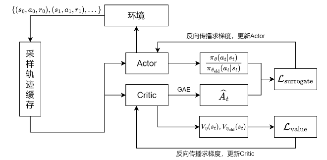
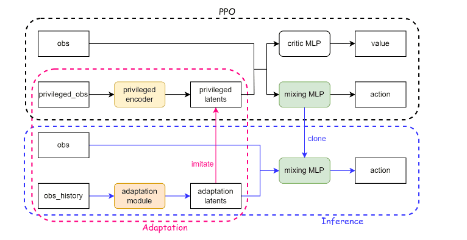

# RL-Lite3

[English](./README.md)


- [RL-Lite3](#rl-lite3)
  - [简介](#简介)
  - [系统架构](#系统架构)
  - [Actor 与 Critic 网络](#actor-与-critic-网络)
    - [网络结构](#网络结构)
    - [观测输入（`obs_buf = 117`）](#观测输入obs_buf--117)
    - [特权观测输入（`privileged_obs_buf = 54`）](#特权观测输入privileged_obs_buf--54)
    - [网络输入](#网络输入)
      - [环境编码器（Environment Encoder）](#环境编码器environment-encoder)
    - [网络输出](#网络输出)
  - [PPO（近端策略优化）](#ppo近端策略优化)
    - [策略梯度与广义优势估计（GAE）](#策略梯度与广义优势估计gae)
    - [PPO —— Clip 策略更新幅度](#ppo--clip-策略更新幅度)
    - [On-Policy Runner](#on-policy-runner)
  - [软件架构](#软件架构)
  - [准备环境](#准备环境)
- [使用方法](#使用方法)
    - [在仿真环境中训练策略](#在仿真环境中训练策略)
    - [在仿真环境中运行控制器](#在仿真环境中运行控制器)
    - [在现实环境中运行控制器](#在现实环境中运行控制器)
  - [参考资料](#参考资料)
## 简介

一个基于学习的四足机器人运动控制器，包含训练和在 DeepRobotics Lite3 上硬件部署所需的所有组件。

## 系统架构



本项目整体基于 **Actor-Critic 架构**：

- **Actor 网络** 是核心的策略网络，输入为系统观测，输出为期望关节位置的均值，作为前馈项传入 **低级控制器**（low-level controller）执行实际控制。

- **Critic 网络** 输入系统的 **特权观测**，输出优势估计（Advantage），传入 **PPO 算法模块** 用于计算 policy gradient，辅助训练 actor 网络。

项目使用 **Isaac Gym** 仿真器提供高性能交互环境，并通过 `RolloutStorage` 对象缓存和组织交互过程中采集的数据。

## Actor 与 Critic 网络



系统从训练到部署一共涉及到 **四个神经网络（MLP）** 的训练和推理部署：
- 核心的 **Actor 网络** 与 **Critic 网络**，
- **环境编码器（environment factor encoder）**：用于从特权观测推测环境信息，
- **自适应模块（adaptation module）**：用于实际部署时通过历史观测替代特权观测以推测环境信息。


### 网络结构

**Actor MLP**

| 层索引 | 层类型   | 输入维度 | 输出维度 | 激活函数   |
|--------|----------|----------|----------|------------|
| 0      | Linear   | 135      | 512      | –          |
| 1      | ELU      | –        | –        | α = 1.0    |
| 2      | Linear   | 512      | 256      | –          |
| 3      | ELU      | –        | –        | α = 1.0    |
| 4      | Linear   | 256      | 128      | –          |
| 5      | ELU      | –        | –        | α = 1.0    |
| 6      | Linear   | 128      | 12       | –          |

**Critic MLP**

| 层索引 | 层类型   | 输入维度 | 输出维度 | 激活函数   |
|--------|----------|----------|----------|------------|
| 0      | Linear   | 135      | 512      | –          |
| 1      | ELU      | –        | –        | α = 1.0    |
| 2      | Linear   | 512      | 256      | –          |
| 3      | ELU      | –        | –        | α = 1.0    |
| 4      | Linear   | 256      | 128      | –          |
| 5      | ELU      | –        | –        | α = 1.0    |
| 6      | Linear   | 128      | 1        | –          |

**注意：** 上述为本项目默认使用的网络结构。根据输入数据和任务需求，网络结构可进行个性化调整以获得最佳性能。

### 观测输入（`obs_buf = 117`）

| 特征名                          | 描述                                          | 维度 |
|----------------------------------|-----------------------------------------------|------|
| `commands[:, :3]`               | 期望的 `[x_vel, y_vel, yaw_vel]` 指令        | 3    |
| `rpy`                           | 基座姿态（roll, pitch, yaw）                 | 3    |
| `base_ang_vel`                  | 基座角速度                                    | 3    |
| `dof_pos`                       | 当前关节位置（12 自由度）                   | 12   |
| `dof_vel`                       | 当前关节速度                                  | 12   |
| `dof_pos_history`              | 最近 3 帧的关节位置                           | 36   |
| `dof_vel_history`              | 最近 2 帧的关节速度                           | 24   |
| `action_history`               | 最近 2 帧的动作输出                           | 24   |
| **总计**                       |                                               | **117** |

### 特权观测输入（`privileged_obs_buf = 54`）

| 特征名                      | 描述                                                    | 维度 |
|-----------------------------|-----------------------------------------------------------|------|
| `contact_states`           | 足端接触标志（二值）                                     | 4    |
| `friction_coefficients`    | 每个足底的地面摩擦系数                                   | 4    |
| `push_forces/torques`      | 作用在 base 上的扰动力与力矩                             | 6    |
| `mass_payloads`            | 载重扰动                                                  | 1    |
| `com_displacements`        | 质心偏移                                                   | 3    |
| `motor_strengths`          | 电机强度扰动（每个关节）                                 | 12   |
| `Kp_factors`               | 比例增益扰动                                               | 12   |
| `Kd_factors`               | 微分增益扰动                                               | 12   |
| **总计**                   |                                                           | **54** |


### 网络输入

在本项目中，**Actor 网络与 Critic 网络的输入相同**，总共由 **135 个维度**组成。  
其中包括来自观测的 **117 个维度**，以及通过环境编码器（MLP）从特权观测中提取的 **18 维环境 latent 特征**。

#### 环境编码器（Environment Encoder）

**环境编码器（Environment Factor Encoder）** 的作用是将特权观测编码为一个低维的**环境嵌入向量（latent）**，该向量作为额外输入传入 Actor 网络，  
从而使策略能够根据环境特性生成自适应的动作。

[ **privileged_obs (54)** ] → 只在训练是使用
         ↓  
[ **env_factor_encoder (MLP)** ] → 编码环境特征
         ↓  
[ **latent_env_embedding (18D)** ]  
         ↓  
[ **obs (117D) + latent (18D)** ] → 合并为网络输入 
         ↓  
[ **actor MLP** ]  
         ↓  
[ **action distribution** ] → 输出关节期望位置的均值和方差


**环境编码器网络结构：**

| 层索引 | 层类型   | 输入维度 | 输出维度 | 激活函数 |
|--------|----------|----------|----------|----------|
| 0      | Linear   | 54       | 256      | –        |
| 1      | ELU      | –        | –        | α = 1.0  |
| 2      | Linear   | 256      | 128      | –        |
| 3      | ELU      | –        | –        | α = 1.0  |
| 4      | Linear   | 128      | 18       | –        |

---

然而，由于在**真实部署（real robot）阶段无法获取 privileged observations**，因此引入了一个额外模块称为 **在线编码器（online encoder 或 adaptation module）**，用于在部署时替代环境编码器的功能。

**Adaptation Module** 以可观测的历史观测序列作为输入。在本项目中，输入为过去 **40 步的 obs 轨迹**，因此输入维度为 **117 × 40 = 4680**。

**自适应模块网络结构：**

| 层索引 | 层类型   | 输入维度 | 输出维度 | 激活函数 |
|--------|----------|----------|----------|----------|
| 0      | Linear   | 4680     | 256      | –        |
| 1      | ELU      | –        | –        | α = 1.0  |
| 2      | Linear   | 256      | 32       | –        |
| 3      | ELU      | –        | –        | α = 1.0  |
| 4      | Linear   | 32       | 18       | –        |

在训练过程中，**Adaptation Module 学习逼近 Environment Encoder 的输出**，从而在测试和部署阶段能够替代其作用。

---

### 网络输出

- Actor 网络的输出为 `self.transition.action_mean`，表示期望关节位置的均值。结合 `self.transition.action_sigma`，构成一个**高斯分布**，从中采样得到实际的关节角度，随后根据低级控制器的类型（如 PD 控制或力控制）计算关节力矩。

- 这种结构属于标准的 **随机策略（stochastic policy）**，引入采样随机性可以鼓励策略探索更多的状态-动作对，避免陷入局部最优。

- Critic 网络的输出为 `self.transition.values`，表示当前状态的价值估计。在后续的 PPO 更新过程中将用于计算策略梯度，相关内容将在 PPO 和 GAE 部分中详细介绍。


## PPO（近端策略优化）

### 策略梯度与广义优势估计（GAE）

在本项目中，策略网络是一个神经网络，其训练过程目标是最大化累计奖励：


其中 \( \hat{A}_t \) 是优势函数，衡量一个动作相比平均动作的好坏程度。在本项目中，优势函数定义如下：


其中 \( \delta_t \) 是时间差分误差（TD error）：


在监督学习中，我们通常构造一个损失函数，通过误差反向传播来更新网络参数。在本项目中，我们构造了一个 **代理损失函数（surrogate loss）**，即总奖励的相反数：

**最小化 surrogate loss 等价于最大化累计奖励**，从而引导 agent 学习更优策略。

---

### PPO —— Clip 策略更新幅度

PPO 的核心思想是解决标准策略梯度算法中策略更新过大带来的策略崩坏问题。

为此，**自然策略梯度（Natural Policy Gradient）** 方法提出将策略视为分布，并考虑新旧策略间的 KL 散度进行约束更新：


但由于该方法涉及 Fisher 信息矩阵的估计或求逆，计算成本高。

随后 **TRPO（信赖域策略优化）** 将其简化为 KL 距离约束下的优化问题：


尽管稳定性提升，TRPO 计算复杂度仍然偏高，效率较低。

**PPO** 是 TRPO 的进一步简化版本，通过引入 **Clipped Surrogate Objective** 限制策略更新幅度，达到相同目标：


相对于TRPO，PPO算法不仅大幅降低了计算复杂度，而且在一些场合甚至实现了更好的性能表现。并且，PPO算法相对其他强化学习算法，鲁棒性（robustness）更高，对超参数变化没那么敏感，调参相对容易，因此成为了当前强化学习控制中最主流的策略优化算法之一。

---

### On-Policy Runner

在整个训练过程中，**On-Policy Runner** 迭代更新三个网络的参数（Actor、Critic、Adaptation Module），通过 Adam 优化器进行误差反向传播。

其中 **Environment Encoder** 的参数保持固定，仅作为 **教师网络（teacher network）** 提供监督信号。

三个网络的损失函数定义如下：

- Actor 网络 surrogate loss：


- Critic 网络 value loss：


- Adaptation Module loss（模仿 Environment Encoder 输出）：


详细实现参见：

`Lite3_rl_training/rsl_rl/rsl_rl/algorithms/ppo.py` → `Update()` 函数


## 软件架构
本仓库由包含以下目录：
- rsl_rl: 一个封装了强化学习方法的包。
- legged_gym: 基于 Gym 环境、专为四足机器人设计的仿真框架。


## 准备环境 
1.  在Ubuntu系统中创建一个python（3.6/3.7/3.8，建议使用3.8）环境。

2.  安装计算平台为CUDA的PyTorch。
```
# pytorch
pip3 install torch==1.10.0+cu113 torchvision==0.11.1+cu113 torchaudio==0.10.0+cu113 -f https://download.pytorch.org/whl/cu113/torch_stable.html
```

3.  从官方网站下载[Isaac Gym](https://developer.nvidia.com/isaac-gym)（版本 >= preview 3），并将其放入项目的根目录中。

4. 使用`pip`安装python依赖项。
```
pip3 install transformations matplotlib gym tensorboard numpy=1.23.5
```

5. 通过 pip 安装 legged_gym 和 rsl_rl
```
cd legged_gym
pip install -e .

cd rsl_rl
pip install -e .
```

# 使用方法

### 在仿真环境中训练策略
```
cd ${PROJECT_DIR}
python3 legged_gym/legged_gym/scripts/train.py --rl_device cuda:0 --sim_device cuda:0 --headless
```

### 在仿真环境中运行控制器
```
cd ${PROJECT_DIR}
python3 legged_gym/legged_gym/scripts/play.py --rl_device cuda:0 --sim_device cuda:0 --load_run ${model_dir} --checkpoint ${model_name}
```
检查您的计算机是否有GPU，若无，请将上述脚本中的单词 `cuda:0` 替换为 `cpu`。
通过 `--load_run` 和 `--checkpoint`  指定网络模型的路径。

### 在现实环境中运行控制器

将策略文件复制到项目[rl_deploy](https://github.com/DeepRoboticsLab/Lite3_rl_deploy.git)中,然后，您可以在现实环境中运行强化学习控制器


## 参考资料
- [legged_gym](https://github.com/leggedrobotics/legged_gym.git)
- [rsl_rl](https://github.com/leggedrobotics/rsl_rl)
- [quadruped-robot](https://gitee.com/HUAWEI-ASCEND/quadruped-robot.git)
  

<a name="ref1">[1]</a> Viktor Makoviychuk, Lukasz Wawrzyniak, Yunrong Guo, Michelle Lu, Kier Storey, Miles Macklin, David Hoeller, Nikita Rudin, Arthur Allshire, Ankur Handa, and Gavriel State. *"Isaac Gym: High Performance GPU-Based Physics Simulation For Robot Learning."* arXiv preprint [arXiv:2108.10470](https://arxiv.org/abs/2108.10470), 2021.
  
[联系我们](https://www.deeprobotics.cn/robot/index/company.html#maps)

